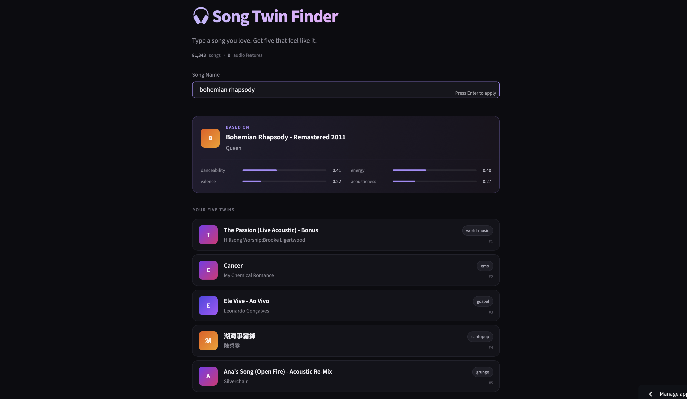

# Song Twin Finder

Type a song you love, get five that feel like it.

**Live app → [song-twin-finder.streamlit.app](https://song-twin-finder.streamlit.app)**



---

## What it does

Search for any song. The app finds it, then returns the five songs in the dataset
that are closest to it in sound.

It does not look at the title, the artist or the genre. It only looks at how the
song actually sounds.

---

## How it works

Every song in the dataset comes with numbers describing its sound. This project
uses nine of them:

| Feature | What it measures |
|---|---|
| danceability | how easy it is to dance to |
| energy | intensity |
| valence | how happy it sounds |
| tempo | speed in BPM |
| acousticness | acoustic vs electronic |
| instrumentalness | whether it has vocals |
| speechiness | how much spoken word |
| liveness | recorded live or not |
| loudness | volume in decibels |

**Three steps:**

**1. Clean the data.** Drop missing values and duplicates. The dataset lists each
song once per genre, so without this the same track appears five times.

**2. Scale everything to 0 to 1.** The step that matters most. Tempo runs to about
200 while danceability runs 0 to 1, so untouched a 40 BPM gap would outweigh a
complete flip in mood and every result would just be songs at a similar speed.
`MinMaxScaler` gives all nine features an equal vote.

**3. Compare.** Each song is now nine numbers, a point in nine-dimensional space.
Cosine similarity finds the five closest.

---


## A note on the results

Matches are based on sound, not meaning. Two songs can share almost identical
danceability, energy and tempo yet belong to completely different genres. A rock
seed can return a drum-and-bass track. That is the model working as designed
rather than a bug.


---

## Run it locally

```bash
git clone https://github.com/shrutipingle02/song-twin-finder.git
cd song-twin-finder

pip install -r requirements.txt
streamlit run app.py
```

---

## Built with

Python · pandas · NumPy · scikit-learn · Streamlit

**Data:** [Spotify Tracks Dataset](https://huggingface.co/datasets/maharshipandya/spotify-tracks-dataset)
on Hugging Face — roughly 114,000 songs, reduced to 81,343 after cleaning.

---

## Author

**Shruti Pingle**

[LinkedIn](https://www.linkedin.com/in/shruti-pingle-aa8034196) ·
[shrutipingle02@gmail.com](mailto:shrutipingle02@gmail.com)
